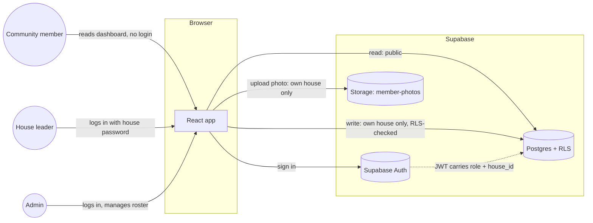
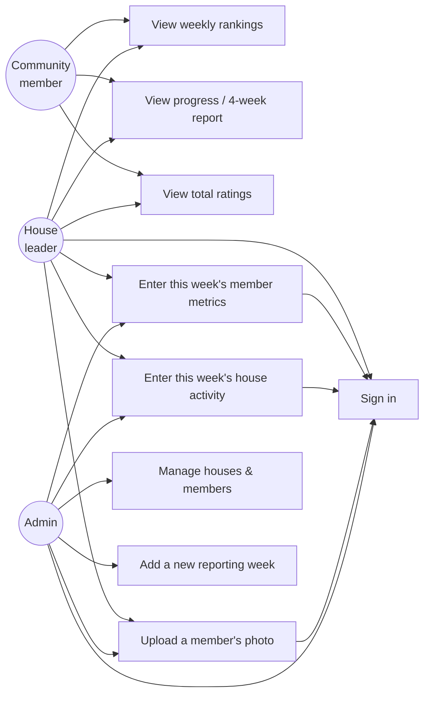
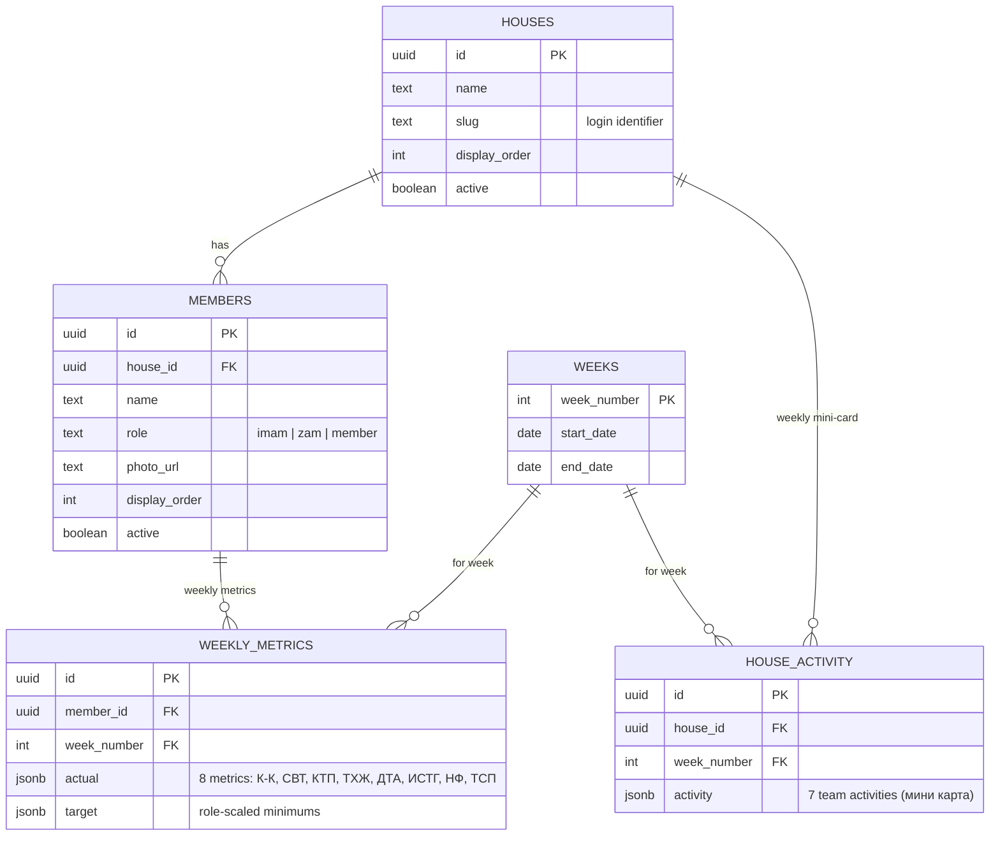

# tdJamaat


A weekly performance dashboard for a Jamaat organized into houses. Each
house's leaders log individual member metrics and team activity once a
week; the app turns that into rankings, per-member scores, and trend
charts everyone in the community can see.

Rebuilt from the original [tdJamaat](https://github.com/Muslim04/tdJamaat)
as an independent project on a normalized data model — real houses and
members instead of a JSON blob re-typed every week — with per-house
authenticated logins instead of one shared password, and a full visual
redesign.

## Contents

- [Features](#features)
- [Stack](#stack)
- [Architecture](#architecture)
- [Data model](#data-model)
- [Scoring](#scoring)
- [Getting started](#getting-started)
- [Project structure](#project-structure)
- [Access & security](#access--security)
- [Credits](#credits)

## Features

- **Public dashboard, gated editing.** Anyone in the community can open
  the site and see current rankings — no login required. Entering or
  changing data requires signing in.
- **Per-house logins.** Each house's leaders share one password and can
  only write that house's own weekly numbers; a separate admin login
  manages the roster and can edit anything. Enforced by Postgres row-level
  security, not just hidden in the UI.
- **Role-scaled targets.** An imam, a zam (deputy), and a regular member
  have different expected minimums for each metric — the app seeds new
  weekly entries with the right target for that person's role instead of
  one flat number for everyone.
- **Four views**: a weekly overview, a per-house breakdown, a
  multi-week progress chart, and a rolling four-week report, plus a
  total-ratings leaderboard across all recorded weeks.
- **Self-service member photos**, uploaded by a house's own leader
  straight from the data-entry screen.
- **Light and dark themes**, both built from the same validated color
  tokens so role and team colors stay distinguishable (including for
  colorblind readers) in either mode.

## Stack

| Layer | Choice |
|---|---|
| Frontend | React 19, TypeScript, Vite (rolldown), Tailwind CSS v4 |
| Charts | Recharts |
| Icons | Lucide React |
| Database & auth | Supabase (Postgres, Row Level Security, Supabase Auth, Storage) |
| Hosting | Vercel |

No custom backend server — the frontend talks to Supabase directly, and
RLS policies are what actually enforce who can write what.

## Architecture



RLS policies read `role` and `house_id` straight out of the signed-in
user's JWT (`supabase/schema.sql`), so a leaked house password can only
ever affect that one house's scores — the database enforces it even if
the frontend had a bug.

### Use cases



## Data model



Houses and members are persistent rows, entered once — a new week just
adds `weekly_metrics`/`house_activity` rows against the existing roster,
instead of re-typing the whole team into a fresh JSON blob every time (how
the original app worked).

## Scoring

Each of the 8 individual metrics (К-К, СВТ, КТП, ТХЖ, ДТА, ИСТГ, НФ, ТСП)
is scored as `(actual / target) × weight`, summed into a member's score;
a house's score adds its members' scores to its mini-card completion,
half-weighted. The per-metric weights are the same for everyone — what
changes by role is the **target** each metric is measured against:

| | К-К | СВТ | КТП | ТХЖ | ДТА | ИСТГ | НФ | ТСП |
|---|---|---|---|---|---|---|---|---|
| Имам | 20 | 2100 | 70 | 2 | 1 | 700 | 7 | 10 |
| Орун басар | 10 | 1400 | 40 | 1 | 1 | 350 | 7 | 7 |
| Мүчө | 7 | 700 | 30 | 1 | 1 | 200 | 7 | 7 |

These are only the *starting* target for a member's first recorded week —
once a leader enters a real target for someone, that value carries
forward week to week (`src/services/dataService.ts`,
`src/components/DataEntryForm.tsx`).

## Getting started

New Supabase project, schema, roster, and login accounts — see
**[SETUP.md](./SETUP.md)** for the full walkthrough. Once that's done:

```bash
npm install
npm run dev
```

```bash
npm run build   # type-check + production build
npm run lint     # eslint
```

## Project structure

```
src/
  components/          shared UI (Header, LoginModal, DataEntryForm, Avatar, Ornament, …)
  components/views/    one component per dashboard tab
  services/            Supabase reads/writes (dataService.ts) and auth (authService.ts)
  utils/               scoring formula and ranking calculations
  types/               shared TypeScript types
supabase/
  schema.sql           tables + row-level security policies
  seed.sql             current houses/members roster
  photo-upload-setup.sql   storage bucket + photo-upload policies
scripts/
  create-auth-users.js provisions the house/admin login accounts
  syr_sozdor.example.json  template for the (gitignored) real passwords file
```

## Access & security

- Anyone can **view** the dashboard — no login needed.
- Each **house** has its own password (shared by that house's leaders)
  and can only write that house's own weekly data.
- The **admin** password can do everything, including managing the
  houses/members roster and opening new weeks.
- Both are enforced by Postgres row-level security (`supabase/schema.sql`),
  not just hidden in the interface.
- Real credentials never live in this repo: `.env`, `.env.admin`, and
  `scripts/syr_sozdor.json` are all gitignored — copy the matching
  `*.example` file and fill in real values locally.

## Credits

The original tdJamaat — the idea, the 8-metric scoring formula, and the
first working version the community actually used — was designed and
built by **Muslim** ([@Muslim04](https://github.com/Muslim04)), who
maintained it until stepping back. This repository is a from-scratch
second version: a new stack, a normalized data model, and a full visual
redesign, but the formula and the concept underneath it are his.
