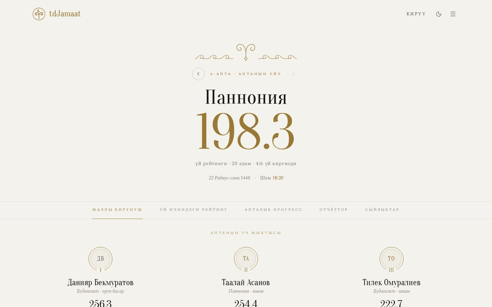
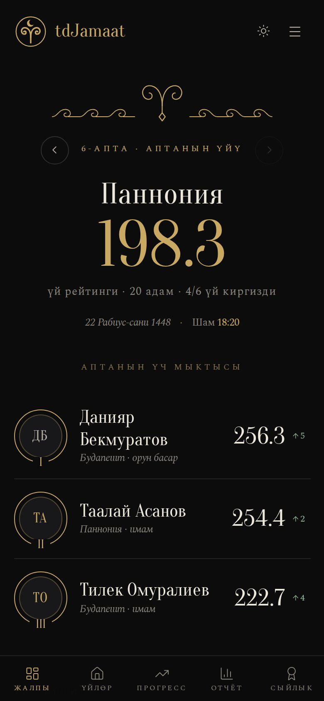
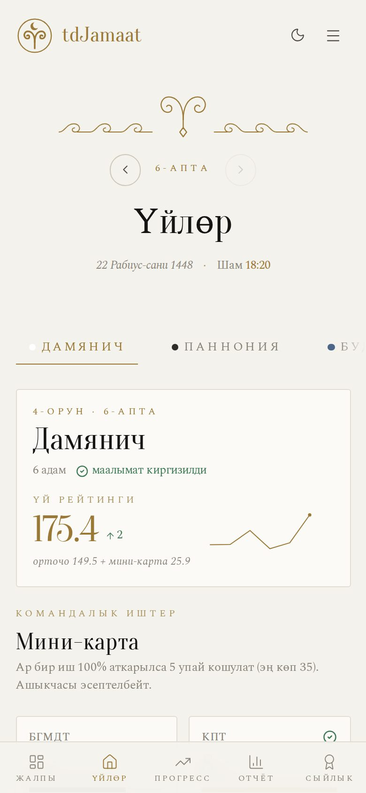
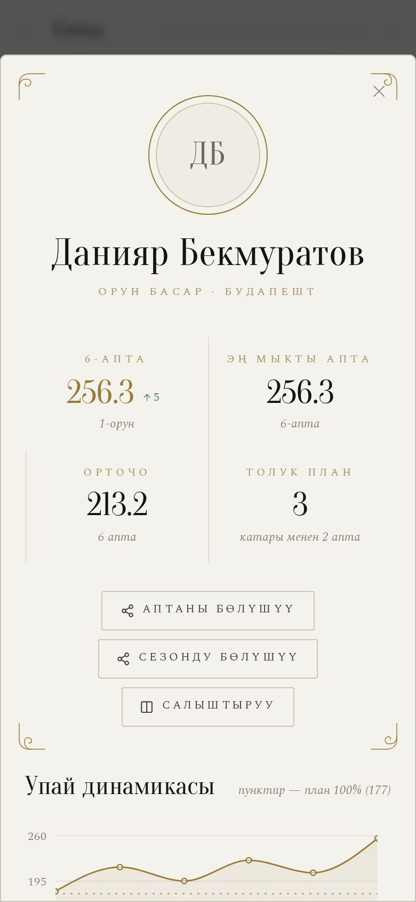
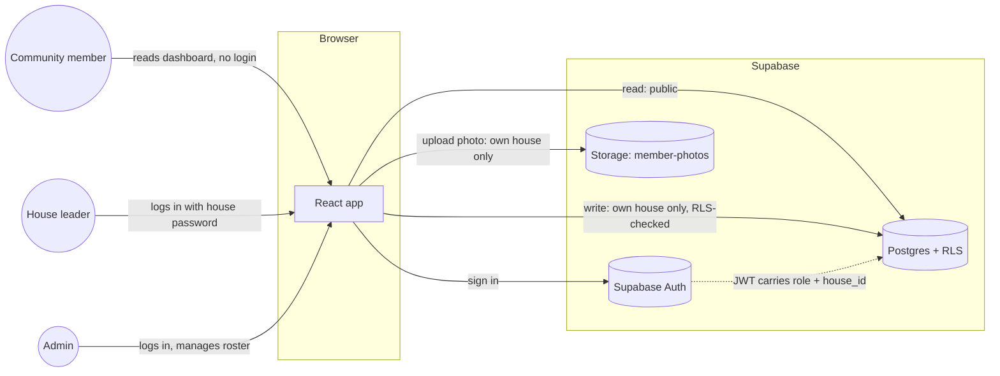
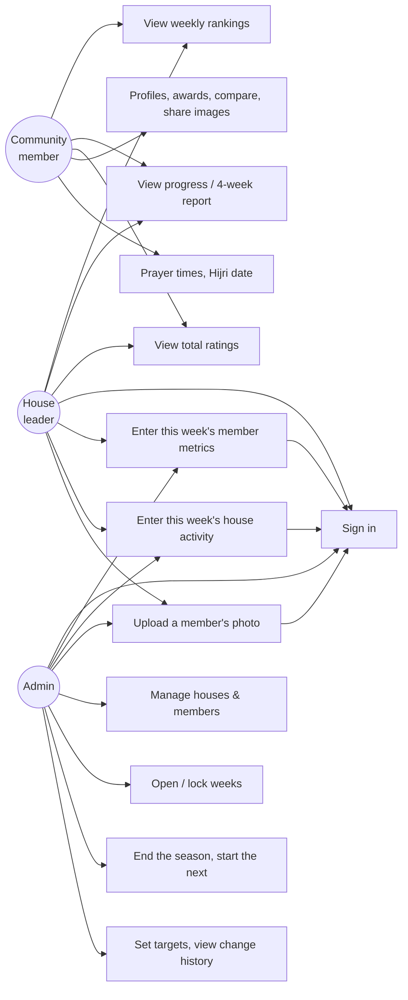
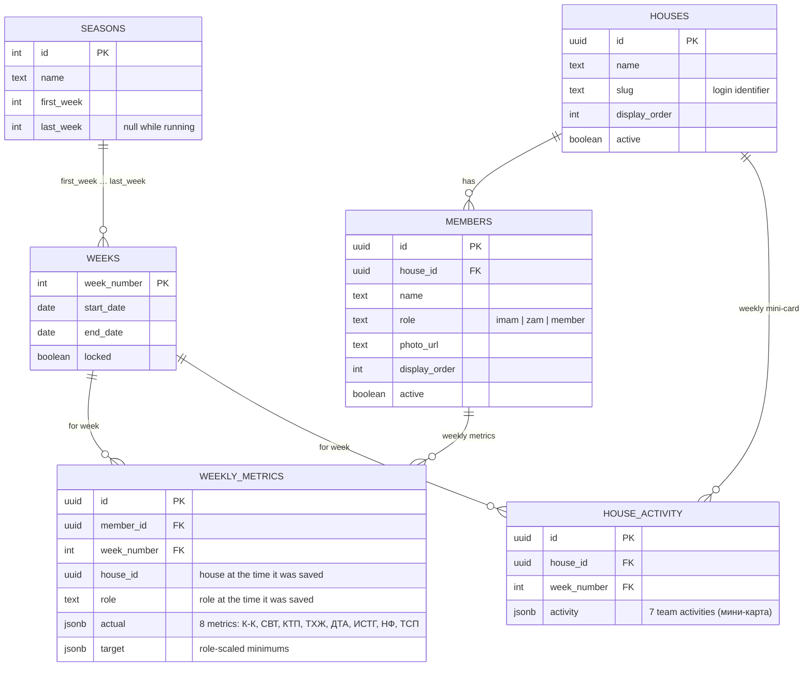

# tdJamaat


[](https://github.com/nurmuhammedkanybekov/tdJamaat-v2/actions/workflows/ci.yml)

**Live: [tdjamaat.vercel.app](https://tdjamaat.vercel.app)**

A weekly performance dashboard for a Kyrgyz Muslim community (jamaat) in
Hungary, organized into houses. Each house's leaders log individual member
metrics and team activity once a week; the app turns that into rankings,
per-member scores, awards and trend charts everyone in the community can
see. The interface is in Kyrgyz.

Rebuilt from the original [tdJamaat](https://github.com/Muslim04/tdJamaat)
as an independent project on a normalized data model — real houses and
members instead of a JSON blob re-typed every week — with per-house
authenticated logins instead of one shared password, seasons, and a full
visual redesign.

<p align="center">
  
</p>
<p align="center">
  
  &nbsp;
  
  &nbsp;
  
</p>
<p align="center"><sub>Light theme, invented demo data. The site also has a black-and-gold dark theme.</sub></p>

## Contents

- [Features](#features)
- [Design](#design)
- [Stack](#stack)
- [Architecture](#architecture)
- [Data model](#data-model)
- [Scoring](#scoring)
- [Getting started](#getting-started)
- [Project structure](#project-structure)
- [Branches](#branches)
- [Access & security](#access--security)
- [Credits](#credits)

## Features

- **Public dashboard, gated editing.** Anyone in the community can open
  the site and see current rankings — no login required. Entering or
  changing data requires signing in.
- **Per-house logins.** Each house's leaders share one password and can
  only write that house's own weekly numbers; a separate admin login
  manages the roster and can edit anything. Enforced by Postgres row-level
  security, not just hidden in the UI.
- **Role-scaled targets.** An imam, a zam (deputy), and a regular member
  have different expected minimums for each metric — the app seeds new
  weekly entries with the right target for that person's role instead of
  one flat number for everyone.
- **Five sections**: a weekly overview (top-3 podium, everyone's rank with
  ▲/▼ movement since last week and a trend line), a per-house breakdown,
  season progress charts, reports (four-week periods and the season
  total), and awards.
- **Personal profile pages.** Tap anyone to see their score trend, how
  close they are to each target this week, best week, perfect-week streak,
  badges and full week-by-week history.
- **Awards.** Strava-style badges for people and houses (star of the week,
  perfect plan, streaks, biggest leap, house of the month, …), each earned
  automatically from the real numbers and shown with the exact reason.
- **Shareable results card.** A ready-made image of the week's rankings to
  send to WhatsApp/Telegram groups (drawn in the browser, no server).
- **Submission status.** Signed-in leaders and the admin see which houses
  have entered this week's numbers.
- **Change history and week locking.** Every save is recorded (who, when,
  before → after); the admin can lock a finished week so it can no longer
  be edited by house leaders. Both enforced in Postgres.
- **Seasons.** Results are kept per season with a full archive of past
  seasons. The admin ends a season with one button; the next one starts at
  week 1, and people can move to new houses without last season's results
  moving with them.
- **Compare.** Put two people or two houses side by side: this week,
  season average and place, best week, perfect weeks, medals, who won more
  weeks head to head, per-metric percentages and a two-line trend chart.
- **Season summary ("Wrapped").** Each profile shows the person's season
  so far, and both the week and the season can be shared as an image, in a
  dark or a light version.
- **Hijri date, prayer times and Ramadan mode.** The header shows today's
  Hijri date and the next prayer; a prayer-times page (Budapest/Debrecen,
  Hanafi Asr, computed on the device, works offline) lists today and the
  next 7 days. During Ramadan the header greets with "Рамазан мубарак" and
  shows iftar time, and the prayer page adds suhoor/iftar.
- **Admin panel**: open/lock weeks, end the season, edit the roster
  (names, roles, houses), edit season targets, download a backup.
- **Installable app (PWA)** with a home-screen icon; refreshes live every
  couple of minutes while open.
- **Adapts to any screen**: phones get a bottom tab bar and card layouts,
  and the whole interface scales smoothly from a phone to a projector.
- **Self-service member photos**, uploaded by a house's own leader
  straight from the data-entry screen.
- **Light and dark themes**, both built from the same validated color
  tokens so role and team colors stay distinguishable (including for
  colorblind readers) in either mode.

## Design

"Түн" (night): black and gold, one metal, a lot of air, with a light "Күн"
(day) theme. Kyrgyz ornament — түндүк, тумар, ram's horn (кочкор мүйүз) —
is drawn as single gold hairlines rather than filled patterns, and the
award medals are drawn as struck coins with a reeded edge. Type is
Oranienbaum (display) and Spectral (text), self-hosted so the app also
works offline.

## Stack

| Layer | Choice |
|---|---|
| Frontend | React 19, TypeScript, Vite (rolldown), Tailwind CSS v4 |
| Charts | Recharts |
| Icons | Lucide React |
| Prayer times | [adhan](https://github.com/batoulapps/adhan-js) (computed on the device) |
| Tests | Vitest |
| Database & auth | Supabase (Postgres, Row Level Security, Supabase Auth, Storage) |
| Hosting | Vercel |

No custom backend server — the frontend talks to Supabase directly, and
RLS policies are what actually enforce who can write what.

## Architecture



RLS policies read `role` and `house_id` straight out of the signed-in
user's JWT (`supabase/schema.sql`), so a leaked house password can only
ever affect that one house's scores — the database enforces it even if
the frontend had a bug.

### Use cases



## Data model



Houses and members are persistent rows, entered once — a new week just
adds `weekly_metrics`/`house_activity` rows against the existing roster,
instead of re-typing the whole team into a fresh JSON blob every time (how
the original app worked).

Also in the database: `season_settings` (the role minimums and mini-card
targets — the source of truth for targets) and `audit_log` (every change:
who, when, before → after). Week numbers keep counting across seasons in
the database; the site shows them per season (each season starts at
"1-апта"). Because every saved row remembers the house it was earned in,
people can change houses between seasons without moving old results.

## Scoring

Each of the 8 individual metrics (К-К, СВТ, КТП, ТХЖ, ДТА, ИСТГ, НФ, ТСП)
is scored as `(actual / target) × weight` and summed into a member's
score. There is no cap — going over the plan counts — and a metric with no
target set gives 0, never a free 100%. Weights: К-К 45, СВТ 1, КТП 35,
ТХЖ 20, ДТА 30, ИСТГ 1, НФ 20, ТСП 25 (exactly 100% on everything = 177).
The weights are the same for everyone; what changes by role is the
**target** each metric is measured against:

| | К-К | СВТ | КТП | ТХЖ | ДТА | ИСТГ | НФ | ТСП |
|---|---|---|---|---|---|---|---|---|
| Имам | 20 | 2100 | 70 | 2 | 1 | 700 | 7 | 10 |
| Орун басар | 10 | 1400 | 40 | 1 | 1 | 350 | 7 | 7 |
| Мүчө | 7 | 700 | 30 | 1 | 1 | 200 | 7 | 7 |

**House rating** = the average member score + the mini-card bonus. The
mini-card has 7 team activities (БГМДТ, КПТ, И-Н.2, КИТЕП, СПОРТ, ТСПХ,
БАБХ; target 7 each, except КИТЕП 5 and СПОРТ 1). Each activity gives up
to 5 points, capped at 100%, so the bonus is at most 35. The average (not
the total) keeps houses of different sizes comparable.

A week a house hasn't submitted shows "—" and isn't counted anywhere
(rankings, averages, trends, reports) while the week is open, so a house
that is simply late doesn't look like it collapsed. Once the admin locks
the week, a house that still hasn't submitted counts as 0 for it
(`weekCounts` in `src/utils/insights.ts`).

Targets are enforced in the database: a person's target carries forward
from their previous week within the season, or starts from the role
minimum. Only the admin can change a target; a value a house leader sends
is replaced by a trigger (`supabase/season-2026-09.sql`,
`supabase/seasons-2026-10.sql`). The formula lives in
`src/utils/scoring.ts` and is covered by tests.

## Getting started

New Supabase project, schema, roster, and login accounts — see
**[SETUP.md](./SETUP.md)** for the full walkthrough. Once that's done:

```bash
npm install
npm run dev
```

```bash
npm run build   # type-check + production build
npm run lint    # eslint
npm test        # vitest: scoring, rankings, awards, seasons, compare, prayer times
```

Every push and pull request runs the same three checks on GitHub Actions
(`.github/workflows/ci.yml`).

## Project structure

```
src/
  TeamPerformanceTracker.tsx   app shell: data loading, routing (#/<view>?m=<member>), modals
  components/          shared UI (AppHeader, ProfileSheet, CompareSheet, ShareSheet,
                       PrayerSheet, AdminPanel, AdminSeason, HistorySheet, DataEntryForm,
                       BadgeMedal, Ornament, ui.tsx, …)
  components/views/    one component per section (Overview, Teams, Progress, Reports, Awards)
  services/            Supabase reads/writes (dataService.ts, buildDataFile.ts) and auth
  utils/               scoring formula, season insights, badges, seasons, compare,
                       share-card drawing, Hijri date, prayer times
  hooks/               useModal (scroll lock + Escape), useMediaQuery, useNow
  test/                test data builders
  pwa.ts               service worker registration + install prompt
  types/               shared TypeScript types
supabase/              run in the SQL editor, in the order listed in SETUP.md
  schema.sql           tables + row-level security policies
  seed.sql             houses/members roster
  photo-upload-setup.sql   storage bucket + photo-upload policies
  season-2026-09.sql   season targets + database-enforced season rules
  add-babh-2026-09.sql, kitep-target-5-2026-10.sql   mid-season target changes
  history-and-locks-2026-10.sql   change history + admin week locking
  seasons-2026-10.sql  seasons, per-week house snapshot, end-of-season function
  update-2026-09-names.sql   one-time fixup, already applied — don't re-run
api/keepalive.js       daily Vercel cron so the free Supabase project never pauses
public/
  favicon.svg, icons/  app mark (crescent above a ram's horn, in a ring)
  manifest.webmanifest, sw.js   installable app (never caches the data)
docs/                  README screenshots
scripts/
  create-auth-users.js provisions the house/admin login accounts
  syr_sozdor.example.json  template for the (gitignored) real passwords file
```

## Branches

- `master` — what runs on [tdjamaat.vercel.app](https://tdjamaat.vercel.app).
- `nurmss` — day-to-day work; merged into `master` when it's ready.
- `nurmss-<topic>` — design experiments waiting for a decision
  (e.g. `nurmss-font`). They are merged only once approved.

## Access & security

- Anyone can **view** the dashboard — no login needed.
- Each **house** has its own password (shared by that house's leaders)
  and can only write that house's own weekly data.
- The **admin** password can do everything, including managing the
  houses/members roster and opening new weeks.
- Both are enforced by Postgres row-level security (`supabase/schema.sql`),
  not just hidden in the interface.
- Real credentials never live in this repo: `.env`, `.env.admin`, and
  `scripts/syr_sozdor.json` are all gitignored — copy the matching
  `*.example` file and fill in real values locally.

## Credits

The original tdJamaat — the idea, the 8-metric scoring formula, and the
first working version the community actually used — was designed and
built by **Muslim** ([@Muslim04](https://github.com/Muslim04)), who
maintained it until stepping back. This repository is a from-scratch
second version: a new stack, a normalized data model, and a full visual
redesign, but the formula and the concept underneath it are his.
