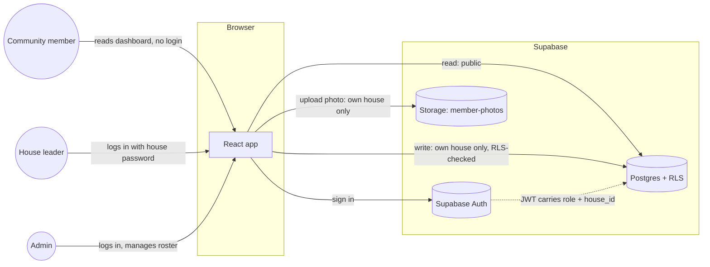
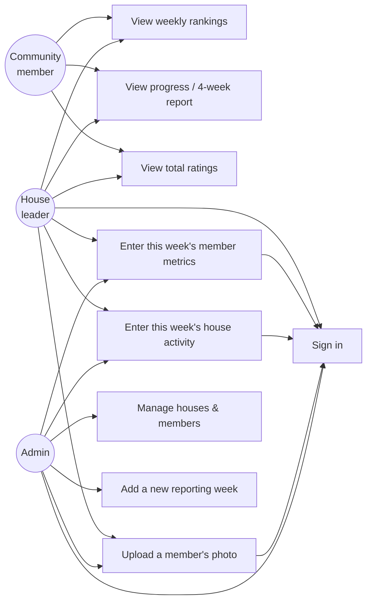
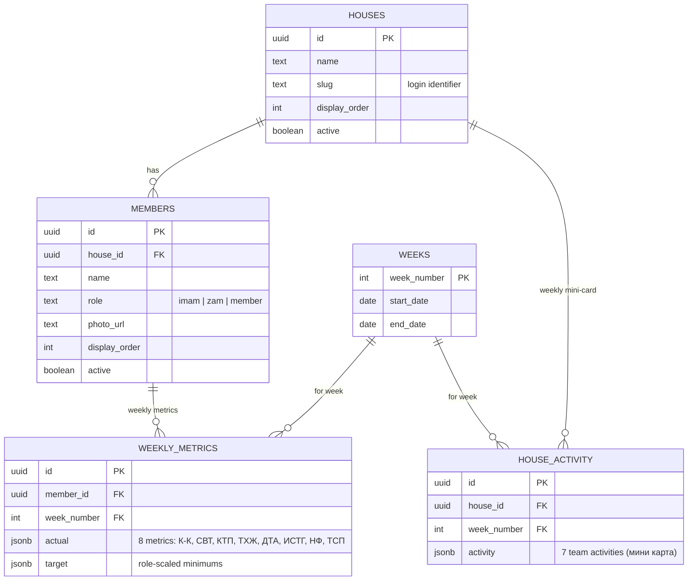

# tdJamaat


A weekly performance dashboard for a Jamaat organized into houses. Each
house's leaders log individual member metrics and team activity once a
week; the app turns that into rankings, per-member scores, and trend
charts everyone in the community can see.

Rebuilt from the original [tdJamaat](https://github.com/Muslim04/tdJamaat)
as an independent project on a normalized data model — real houses and
members instead of a JSON blob re-typed every week — with per-house
authenticated logins instead of one shared password, and a full visual
redesign.

## Contents

- [Features](#features)
- [Stack](#stack)
- [Architecture](#architecture)
- [Data model](#data-model)
- [Scoring](#scoring)
- [Getting started](#getting-started)
- [Project structure](#project-structure)
- [Access & security](#access--security)
- [Credits](#credits)

## Features

- **Public dashboard, gated editing.** Anyone in the community can open
  the site and see current rankings — no login required. Entering or
  changing data requires signing in.
- **Per-house logins.** Each house's leaders share one password and can
  only write that house's own weekly numbers; a separate admin login
  manages the roster and can edit anything. Enforced by Postgres row-level
  security, not just hidden in the UI.
- **Role-scaled targets.** An imam, a zam (deputy), and a regular member
  have different expected minimums for each metric — the app seeds new
  weekly entries with the right target for that person's role instead of
  one flat number for everyone.
- **Five sections**: a weekly overview (top-3 podium, everyone's rank with
  ▲/▼ movement since last week and a trend line), a per-house breakdown,
  season progress charts, reports (four-week periods and the season
  total), and awards.
- **Personal profile pages.** Tap anyone to see their score trend, how
  close they are to each target this week, best week, perfect-week streak,
  badges and full week-by-week history.
- **Awards.** Strava-style badges for people and houses (star of the week,
  perfect plan, streaks, biggest leap, house of the month, …), each earned
  automatically from the real numbers and shown with the exact reason.
- **Shareable results card.** A ready-made image of the week's rankings to
  send to WhatsApp/Telegram groups (drawn in the browser, no server).
- **Submission status.** Signed-in leaders and the admin see which houses
  have entered this week's numbers.
- **Change history and week locking.** Every save is recorded (who, when,
  before → after); the admin can lock a finished week so it can no longer
  be edited by house leaders. Both enforced in Postgres.
- **Seasons.** Results are kept per season with a full archive of past
  seasons. The admin ends a season with one button; the next one starts at
  week 1, and people can move to new houses without last season's results
  moving with them.
- **Compare.** Put two people or two houses side by side: this week,
  season average and place, best week, perfect weeks, medals, who won more
  weeks head to head, per-metric percentages and a two-line trend chart.
- **Season summary ("Wrapped").** Each profile shows the person's season
  so far, and both the week and the season can be shared as an image, in a
  dark or a light version.
- **Hijri date, prayer times and Ramadan mode.** The header shows today's
  Hijri date and the next prayer; a prayer-times page (Budapest/Debrecen,
  Hanafi Asr, computed on the device, works offline) lists today and the
  next 7 days. During Ramadan the header greets with "Рамазан мубарак" and
  shows iftar time, and the prayer page adds suhoor/iftar.
- **Admin panel**: open/lock weeks, end the season, edit the roster
  (names, roles, houses), edit season targets, download a backup.
- **Installable app (PWA)** with a home-screen icon; refreshes live every
  couple of minutes while open.
- **Adapts to any screen**: phones get a bottom tab bar and card layouts,
  and the whole interface scales smoothly from a phone to a projector.
- **Self-service member photos**, uploaded by a house's own leader
  straight from the data-entry screen.
- **Light and dark themes**, both built from the same validated color
  tokens so role and team colors stay distinguishable (including for
  colorblind readers) in either mode.

## Stack

| Layer | Choice |
|---|---|
| Frontend | React 19, TypeScript, Vite (rolldown), Tailwind CSS v4 |
| Charts | Recharts |
| Icons | Lucide React |
| Database & auth | Supabase (Postgres, Row Level Security, Supabase Auth, Storage) |
| Hosting | Vercel |

No custom backend server — the frontend talks to Supabase directly, and
RLS policies are what actually enforce who can write what.

## Architecture



RLS policies read `role` and `house_id` straight out of the signed-in
user's JWT (`supabase/schema.sql`), so a leaked house password can only
ever affect that one house's scores — the database enforces it even if
the frontend had a bug.

### Use cases



## Data model



Houses and members are persistent rows, entered once — a new week just
adds `weekly_metrics`/`house_activity` rows against the existing roster,
instead of re-typing the whole team into a fresh JSON blob every time (how
the original app worked).

## Scoring

Each of the 8 individual metrics (К-К, СВТ, КТП, ТХЖ, ДТА, ИСТГ, НФ, ТСП)
is scored as `(actual / target) × weight`, summed into a member's score;
houses are ranked by their members' average score. Weights: К-К 45,
СВТ 1, КТП 35, ТХЖ 20, ДТА 30, ИСТГ 1, НФ 20, ТСП 25 — the same for
everyone; what
changes by role is the **target** each metric is measured against:

| | К-К | СВТ | КТП | ТХЖ | ДТА | ИСТГ | НФ | ТСП |
|---|---|---|---|---|---|---|---|---|
| Имам | 20 | 2100 | 70 | 2 | 1 | 700 | 7 | 10 |
| Орун басар | 10 | 1400 | 40 | 1 | 1 | 350 | 7 | 7 |
| Мүчө | 7 | 700 | 30 | 1 | 1 | 200 | 7 | 7 |

These are only the *starting* target for a member's first recorded week —
once a leader enters a real target for someone, that value carries
forward week to week (`src/services/dataService.ts`,
`src/components/DataEntryForm.tsx`).

## Getting started

New Supabase project, schema, roster, and login accounts — see
**[SETUP.md](./SETUP.md)** for the full walkthrough. Once that's done:

```bash
npm install
npm run dev
```

```bash
npm run build   # type-check + production build
npm run lint     # eslint
```

## Project structure

```
src/
  components/          shared UI (AppHeader, ProfileSheet, AdminPanel, HistorySheet,
                       ShareSheet, BadgeMedal, DataEntryForm, Ornament, ui.tsx, …)
  components/views/    one component per section (Overview, Teams, Progress, Reports, Awards)
  services/            Supabase reads/writes (dataService.ts) and auth (authService.ts)
  utils/               scoring formula, season insights, badges, seasons, compare,
                       share-card drawing, Hijri date, prayer times
  pwa.ts               service worker registration + install prompt
  types/               shared TypeScript types
supabase/
  schema.sql           tables + row-level security policies
  seed.sql             current houses/members roster
  photo-upload-setup.sql   storage bucket + photo-upload policies
  season-2026-09.sql   season targets + database-enforced season rules
  history-and-locks-2026-10.sql   change history + admin week locking
  seasons-2026-10.sql  seasons, per-week house snapshot, end-of-season function
public/
  favicon.svg, icons/  app mark (eight-pointed star, crescent, tunduk)
  manifest.webmanifest, sw.js   installable app
scripts/
  create-auth-users.js provisions the house/admin login accounts
  syr_sozdor.example.json  template for the (gitignored) real passwords file
```

## Access & security

- Anyone can **view** the dashboard — no login needed.
- Each **house** has its own password (shared by that house's leaders)
  and can only write that house's own weekly data.
- The **admin** password can do everything, including managing the
  houses/members roster and opening new weeks.
- Both are enforced by Postgres row-level security (`supabase/schema.sql`),
  not just hidden in the interface.
- Real credentials never live in this repo: `.env`, `.env.admin`, and
  `scripts/syr_sozdor.json` are all gitignored — copy the matching
  `*.example` file and fill in real values locally.

## Credits

The original tdJamaat — the idea, the 8-metric scoring formula, and the
first working version the community actually used — was designed and
built by **Muslim** ([@Muslim04](https://github.com/Muslim04)), who
maintained it until stepping back. This repository is a from-scratch
second version: a new stack, a normalized data model, and a full visual
redesign, but the formula and the concept underneath it are his.
